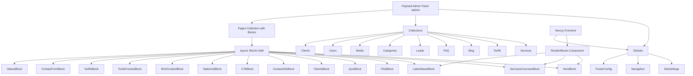

# BUX&TAXES — Full Rewrite to Payload CMS Page Builder Architecture

## Overview

Полная переработка проекта BUX&TAXES с текущей архитектуры (хардкод + частичное использование Payload CMS) на полноценную **Page Builder** архитектуру с **Payload CMS Blocks + Globals**, где весь контент управляется через админ-панель.

## Current State Analysis

### Что уже есть:
- Next.js 15 + Payload CMS 3.72 (monolith)
- PostgreSQL через `@payloadcms/db-postgres`
- Lexical rich text editor
- 8 коллекций: Users, Services, Tariffs, Blog, FAQ, Leads, Categories, Media
- Админ-панель на `/admin`
- Seed скрипт с тестовыми данными

### Проблемы текущей архитектуры:
- **Hero, FAQ, Contacts, Clients, Quiz, About, Footer, Navbar** — все данные захардкожены в компонентах
- Нет Globals (настройки сайта, навигация, контакты)
- Нет Blocks (page builder) — страницы имеют фиксированную структуру
- Все коллекции в одном файле `collections/all.ts`
- Нет типизации через `payload-types.ts`
- Нет Access Control (кроме базового на Leads)

---

## Target Architecture



---

## New File Structure

```
src/
├── payload.config.ts                    # Main config
├── payload-types.ts                     # Auto-generated types
├── access/                              # Access control policies
│   ├── isAdmin.ts
│   └── isAdminOrPublished.ts
├── collections/                         # Each collection in its own file
│   ├── Users.ts
│   ├── Services.ts
│   ├── Tariffs.ts
│   ├── Blog.ts
│   ├── FAQ.ts
│   ├── Leads.ts
│   ├── Categories.ts
│   ├── Media.ts
│   ├── Clients.ts                       # NEW: client logos
│   └── Pages.ts                         # NEW: page builder
├── globals/                             # Payload Globals
│   ├── SiteSettings.ts
│   ├── Navigation.ts
│   └── FooterConfig.ts
├── blocks/                              # Payload Blocks definitions
│   ├── HeroBlock.ts
│   ├── ServicesOverviewBlock.ts
│   ├── LatestNewsBlock.ts
│   ├── FAQBlock.ts
│   ├── QuizBlock.ts
│   ├── ClientsBlock.ts
│   ├── ContactInfoBlock.ts
│   ├── ContactFormBlock.ts
│   ├── CTABlock.ts
│   ├── StatsGridBlock.ts
│   ├── RichContentBlock.ts
│   ├── ToolsPreviewBlock.ts
│   ├── TariffsBlock.ts
│   └── ValuesBlock.ts
├── components/
│   ├── RichText.tsx                     # Keep existing
│   ├── RenderBlocks.tsx                 # NEW: block renderer
│   ├── blocks/                          # NEW: block frontend components
│   │   ├── HeroBlock.tsx
│   │   ├── ServicesOverviewBlock.tsx
│   │   ├── LatestNewsBlock.tsx
│   │   ├── FAQBlock.tsx
│   │   ├── QuizBlock.tsx
│   │   ├── ClientsBlock.tsx
│   │   ├── ContactInfoBlock.tsx
│   │   ├── ContactFormBlock.tsx
│   │   ├── CTABlock.tsx
│   │   ├── StatsGridBlock.tsx
│   │   ├── RichContentBlock.tsx
│   │   ├── ToolsPreviewBlock.tsx
│   │   ├── TariffsBlock.tsx
│   │   └── ValuesBlock.tsx
│   ├── forms/
│   │   └── ContactForm.tsx              # Refactored
│   ├── layout/
│   │   ├── Footer.tsx                   # Uses FooterConfig global
│   │   └── Navbar.tsx                   # Uses Navigation global
│   └── ui/                              # Keep existing UI components
├── app/
│   ├── (payload)/                       # Keep as is
│   ├── (site)/
│   │   ├── layout.tsx                   # Uses SiteSettings + Navigation globals
│   │   ├── page.tsx                     # Renders Pages collection slug=home
│   │   ├── [slug]/
│   │   │   └── page.tsx                 # NEW: dynamic page renderer
│   │   ├── blog/                        # Keep, but fetch from Payload
│   │   ├── services/[slug]/             # Keep, fetch from Payload
│   │   ├── tariffs/                     # Keep or convert to block
│   │   └── calculators/                 # Keep as is (client-side logic)
│   └── api/                             # Keep Payload API routes
├── hooks/
│   └── useCalculationHistory.ts         # Keep
├── lib/
│   ├── payload.ts                       # NEW: getPayload helper
│   ├── salary-calculator.ts             # Keep
│   ├── tax-constants.ts                 # Keep
│   ├── utils.ts                         # Keep
│   └── seed/
│       └── index.ts                     # Rewrite for new architecture
```

---

## Phase 1: Restructure Collections

Split `src/collections/all.ts` into individual files:

| File | Description |
|------|-------------|
| `src/collections/Users.ts` | Auth collection, admin users |
| `src/collections/Services.ts` | Services with SEO, FAQ, pricing |
| `src/collections/Tariffs.ts` | Pricing tiers |
| `src/collections/Blog.ts` | Blog posts with categories, SEO |
| `src/collections/FAQ.ts` | FAQ items |
| `src/collections/Leads.ts` | Contact form submissions |
| `src/collections/Categories.ts` | Blog categories |
| `src/collections/Media.ts` | Image uploads |
| `src/collections/Clients.ts` | **NEW** — Client logos for the clients section |
| `src/collections/Pages.ts` | **NEW** — Page builder with blocks layout |

### New: Clients Collection
```typescript
{
  slug: 'clients',
  fields: [
    { name: 'name', type: 'text', required: true },
    { name: 'logo', type: 'upload', relationTo: 'media', required: true },
    { name: 'url', type: 'text' },
    { name: 'order', type: 'number' }
  ]
}
```

### New: Pages Collection
```typescript
{
  slug: 'pages',
  admin: { useAsTitle: 'title' },
  fields: [
    { name: 'title', type: 'text', required: true },
    { name: 'slug', type: 'text', required: true, unique: true },
    { name: 'layout', type: 'blocks', blocks: [...allBlocks] },
    { name: 'seo', type: 'group', fields: [
      { name: 'title', type: 'text' },
      { name: 'description', type: 'textarea' },
      { name: 'image', type: 'upload', relationTo: 'media' }
    ]}
  ]
}
```

---

## Phase 2: Create Globals

### SiteSettings Global
```typescript
{
  slug: 'site-settings',
  fields: [
    { name: 'siteName', type: 'text', defaultValue: 'BUX&TAXES' },
    { name: 'siteDescription', type: 'textarea' },
    { name: 'logo', type: 'upload', relationTo: 'media' },
    { name: 'phone', type: 'text' },
    { name: 'phoneSecondary', type: 'text' },
    { name: 'email', type: 'text' },
    { name: 'emailSupport', type: 'text' },
    { name: 'address', type: 'textarea' },
    { name: 'whatsapp', type: 'text' },
    { name: 'telegram', type: 'text' },
    { name: 'workingHours', type: 'text' },
    { name: 'mapEmbedUrl', type: 'text' },
    { name: 'statsBar', type: 'group', fields: [
      { name: 'enabled', type: 'checkbox', defaultValue: true },
      { name: 'items', type: 'array', fields: [
        { name: 'label', type: 'text' },
        { name: 'value', type: 'text' }
      ]}
    ]}
  ]
}
```

### Navigation Global
```typescript
{
  slug: 'navigation',
  fields: [
    { name: 'items', type: 'array', fields: [
      { name: 'label', type: 'text', required: true },
      { name: 'url', type: 'text', required: true },
      { name: 'openInNewTab', type: 'checkbox' }
    ]},
    { name: 'ctaButton', type: 'group', fields: [
      { name: 'label', type: 'text' },
      { name: 'url', type: 'text' }
    ]}
  ]
}
```

### FooterConfig Global
```typescript
{
  slug: 'footer',
  fields: [
    { name: 'description', type: 'textarea' },
    { name: 'columns', type: 'array', fields: [
      { name: 'title', type: 'text' },
      { name: 'links', type: 'array', fields: [
        { name: 'label', type: 'text' },
        { name: 'url', type: 'text' }
      ]}
    ]},
    { name: 'copyright', type: 'text' }
  ]
}
```

---

## Phase 3: Create Blocks

Each block is a Payload Block definition + a React component for rendering.

### Block Definitions

| Block | Key Fields | Purpose |
|-------|-----------|---------|
| `HeroBlock` | heading, highlightedWord, subtitle, bulletPoints[], stats[], ctaButtons[] | Main hero section |
| `ServicesOverviewBlock` | heading, subtitle, showCount, fallbackServices[] | Services grid from collection |
| `LatestNewsBlock` | heading, subtitle, showCount | Latest blog posts |
| `FAQBlock` | heading, subtitle, source: 'collection' or 'custom', customFaqs[] | FAQ accordion |
| `QuizBlock` | heading, subtitle, steps[], completionMessage | Interactive quiz |
